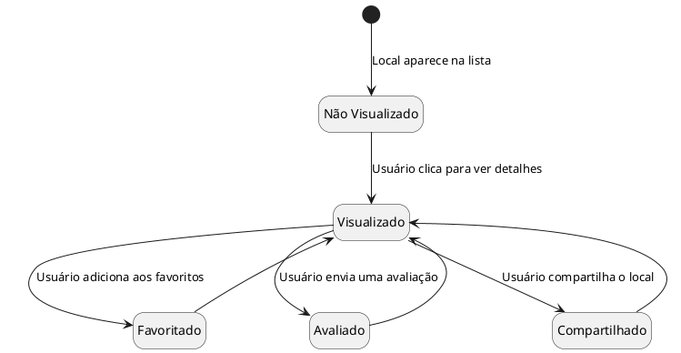
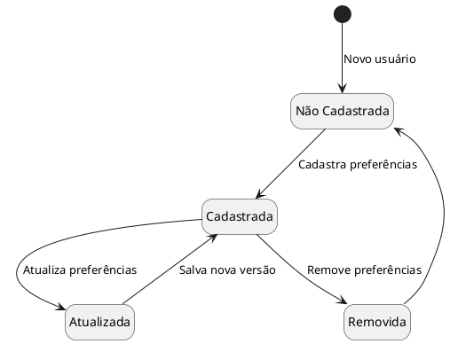

# Status de um Local no ExploraAI

```plantuml
@startuml
hide empty description

state "Não Visualizado" as NV
state "Visualizado" as V
state "Favoritado" as F
state "Avaliado" as AV
state "Compartilhado" as C

[*] --> NV : Local aparece na lista

NV --> V : Usuário clica para ver detalhes

V --> F : Usuário adiciona aos favoritos
V --> AV : Usuário envia uma avaliação
V --> C : Usuário compartilha o local

F --> V
AV --> V
C --> V

@enduml

```

# Status da preferencia do Usuário

```plantuml
@startuml
hide empty description

state "Não Cadastrada" as NC
state "Cadastrada" as CD
state "Atualizada" as AT
state "Removida" as RM

[*] --> NC : Novo usuário

NC --> CD : Cadastra preferências
CD --> AT : Atualiza preferências
AT --> CD : Salva nova versão
CD --> RM : Remove preferências
RM --> NC

@enduml

```
