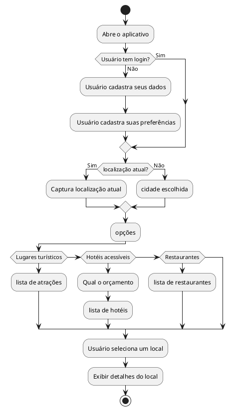

# 1. 🌟 Caso de Uso: Solicitar Recomendações

## 1.1. Identificação

* *Nome*: Solicitar Recomendações
* *Ator Primário*: Usuário
* *Descrição*: Gera uma lista de sugestões personalizadas de locais com base nas preferências e localização do usuário.

---

## 1.2. Visão Geral

plantuml
@startuml
actor "Usuário" as Usuario
actor "Sistema de Geolocalização" as Geo

rectangle "ExploraAI" {
  usecase "Capturar localização atual" as UC1
  usecase "Escolher cidade manualmente" as UC2
  usecase "Selecionar tipo de recomendação" as UC3
  usecase "Gerar lista de locais" as UC4
  usecase "Exibir resultados personalizados" as UC5
}

Usuario --> UC1
Usuario --> UC2
Usuario --> UC3
Usuario --> UC4
Usuario --> UC5
Geo --> UC1
@enduml

---

## 1.3. Fluxo Principal de Eventos

1. O usuário solicita recomendações.
2. O sistema tenta capturar a localização atual automaticamente.
3. O sistema pergunta se o usuário deseja informar uma cidade diferente.
4. Se sim, o usuário digita a cidade desejada.
5. O sistema exibe opções: Lugares Turísticos, Hotéis Acessíveis, Restaurantes.
6. O usuário escolhe uma categoria.
7. Se for Hotéis, o sistema pergunta se deseja informar um novo orçamento.
8. O sistema gera uma lista de locais personalizados com base nas preferências e localização.
9. O sistema exibe os resultados.

---

## 1.4. Fluxos Alternativos

### 1.4.1. a. Cidade Manual

* O usuário opta por digitar manualmente a cidade de interesse.
* O sistema substitui a localização detectada pela informada.

### 1.4.2. b. Orçamento Personalizado

* Se o usuário desejar, pode informar um novo orçamento para buscar hotéis.
* Caso não informe, o sistema usa o valor salvo nas preferências.

---

## 1.5. Fluxos de Exceção

### 1.5.1. a. Falha na captura da localização

* Se a localização automática falhar, o sistema solicita cidade manual.

### 1.5.2. b. Nenhum resultado encontrado

* Se nenhuma opção for encontrada, o sistema exibe uma mensagem amigável ao usuário.

---

## 1.6. Pré-condições

* O usuário deve estar logado.
* As preferências devem estar cadastradas.

---

## 1.7. Pós-condições

* O sistema exibe recomendações com base nos dados mais recentes.

---

## 1.8. Regras de Negócio

* A busca deve respeitar localização e preferências.
* O sistema deve usar o orçamento informado ou o padrão salvo.
* O sistema deve respeitar filtros alimentares, culturais ou financeiros.

---

## 1.9. Perfis de Usuário

| Perfil                 | Descrição                                        |
| ---------------------- | ------------------------------------------------ |
| *Turista*            | Usuários que desejam explorar novas cidades.     |
| *Local*              | Usuários que buscam sugestões na própria cidade. |
| *Orçamento limitado* | Buscam opções mais acessíveis financeiramente.   |

---

# 2. Diagrama de Atividades

