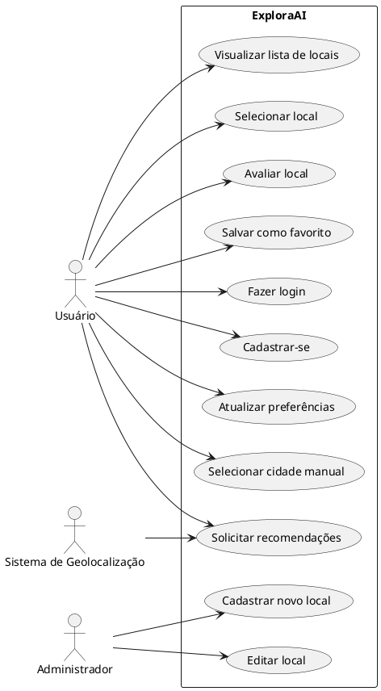
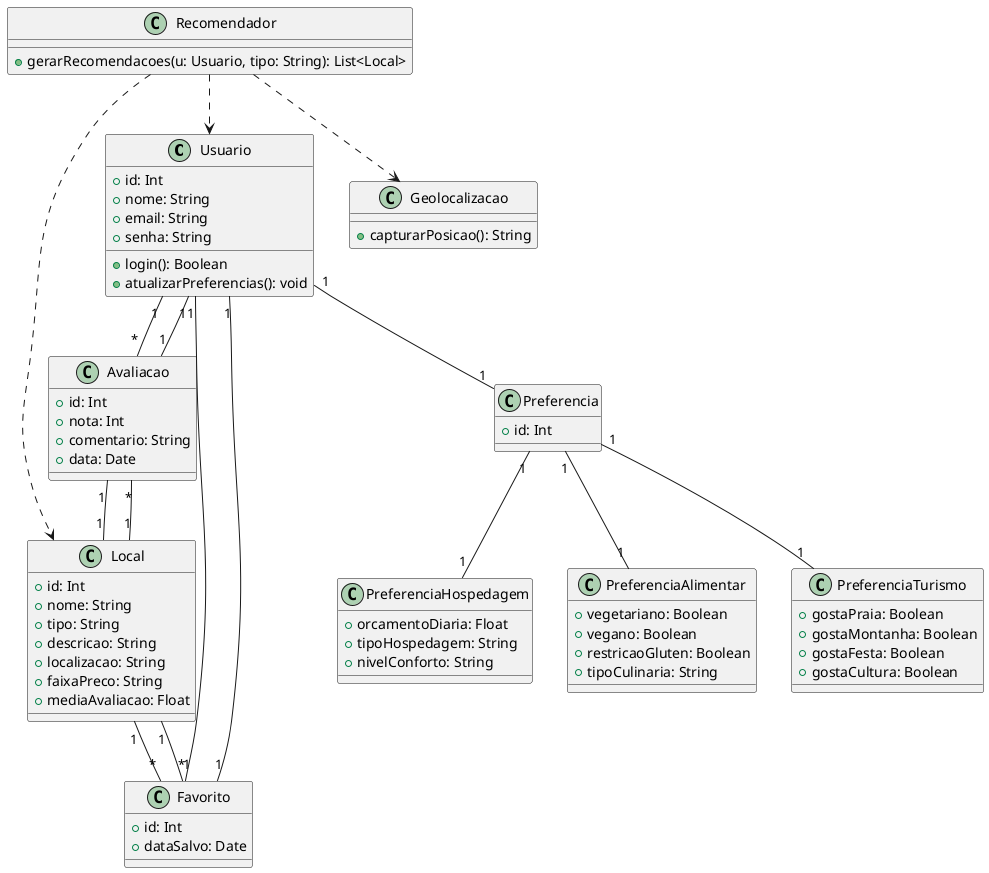
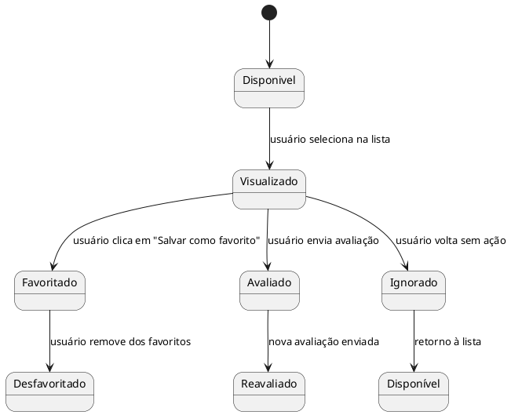

# 📊 Diagramas UML do Sistema

## Visão Geral do Sistema
## Diagrama de Caso de Uso

## Casos de Uso Descritivo
### CSU01 – Solicitar Recomendações

*Finalidade:*  
Gerar uma lista de recomendações personalizadas de locais (turismo, hotéis, restaurantes) com base nas preferências e localização do usuário.

*Atores:*  
Usuário, SistemaGeolocalizacao

*RF:*  
- RF01: Capturar localização atual
- RF02: Permitir que o usuário escolha uma cidade alternativa
- RF03: Consultar locais com base nas preferências

*RNF:*  
- RNF01: Resposta em até 3 segundos
- RNF02: Utilizar dados criptografados
- RNF03: Interface responsiva e acessível

*Pré-condição:*  
Usuário logado e com preferências cadastradas.

*Pós-condição:*  
Sistema exibe uma lista personalizada de locais.

*Fluxo Principal:*  
1. Usuário solicita recomendações.  
2. O sistema captura a localização ou aceita uma cidade alternativa.  
3. O sistema busca locais compatíveis com o perfil.  
4. Exibe a lista de resultados.  

*Fluxo Alternativo:*  
- FA01: Se não houver localização válida, solicitar manualmente.  
- FA02: Se não houver locais, exibir aviso amigável.

---

### CSU02 – Avaliar Local

*Finalidade:*  
Permitir que o usuário avalie um local após sua experiência.

*Atores:*  
Usuário

*RF:*  
- RF04: Inserir nota de 1 a 5
- RF05: Inserir comentário

*Pré-condição:*  
Usuário logado e local visitado.

*Pós-condição:*  
Avaliação salva com sucesso.

*Fluxo Principal:*  
1. Usuário acessa detalhes do local.  
2. Seleciona a opção "Avaliar".  
3. Informa nota e comentário.  
4. Sistema salva a avaliação.

*Fluxo Alternativo:*  
- FA01: Se o usuário já avaliou o local, o sistema exibe um aviso.
-

## 🔹 Diagrama de Classes

## 🔹 Diagrama de Estados

